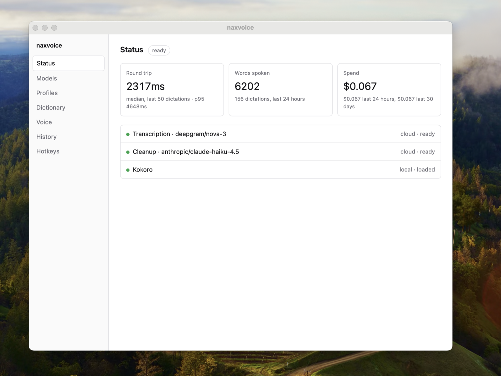
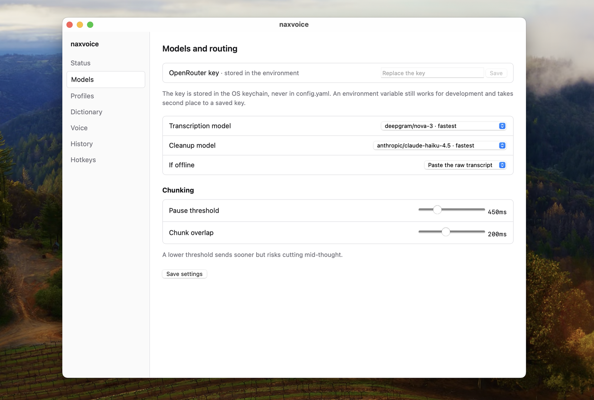
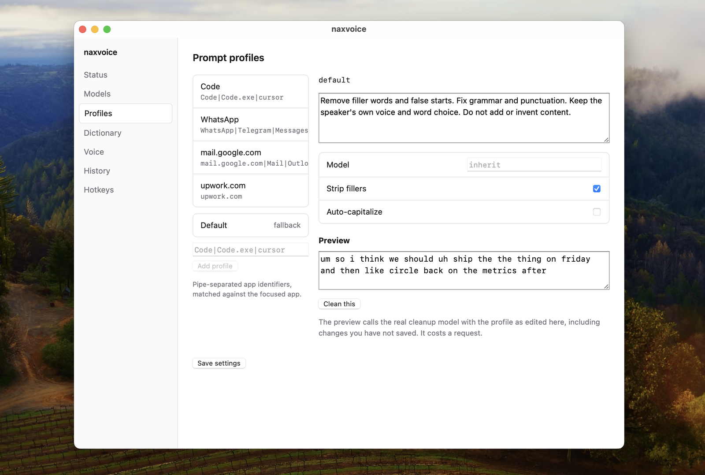
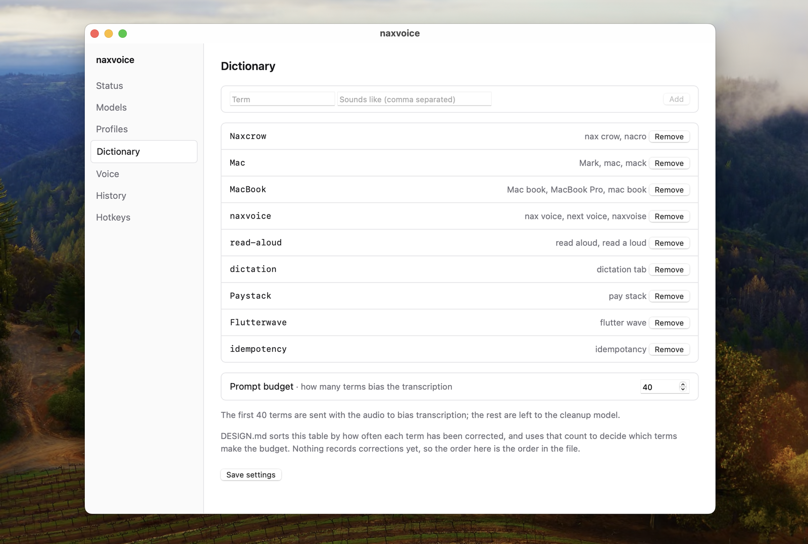
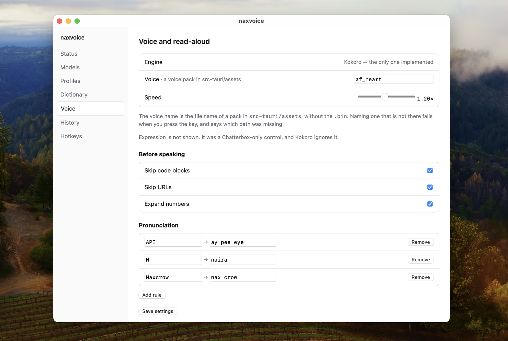
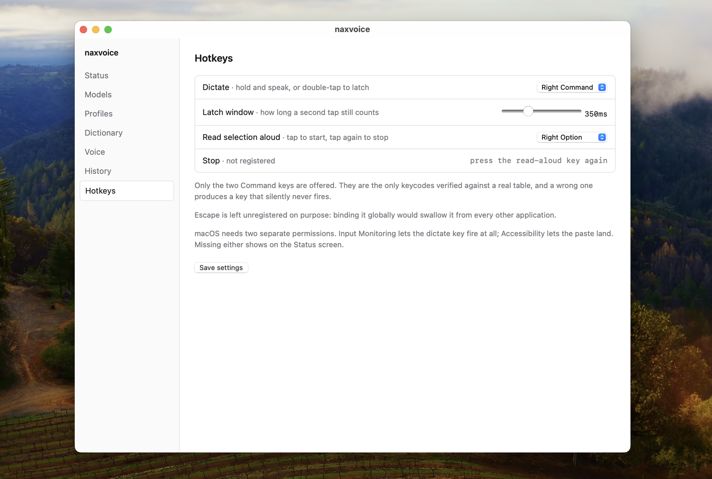

# naxvoice

System-wide dictation and read-aloud. Hold a key and speak, polished text lands at
your cursor. Select any text, press a key, hear it read back in a voice you chose.

**macOS only, today.** Windows is designed for and partly written — the clipboard,
paste and foreground-window code are all there — but the dictation key itself is
not: watching a bare modifier needs a low-level keyboard hook, and
`platform/win32.rs` says so with an explicit `bail!` rather than failing quietly.
Until that lands, the key will never fire on Windows. Help welcome.

Transcription and cleanup run through OpenRouter on one API key. Speech synthesis
runs locally, so reading is unlimited and works offline.

## What it looks like

There is no main window. naxvoice lives in the menu bar; this is the settings
window behind it.

| | |
|---|---|
|  |  |
| **Status** — what is loaded, and what it has cost you | **Models** — routing, and the key that never touches disk |
|  |  |
| **Profiles** — a different cleanup prompt per app | **Dictionary** — words the transcriber keeps mishearing |
|  |  |
| **Voice** — the read-aloud voice and how it says things | **Hotkeys** — one key to dictate, one to read |

## Why it's built this way

**Rolling chunk transcription.** OpenRouter's transcription endpoint is HTTP
request/response with no realtime websocket, so we can't stream. Instead, voice
activity detection splits your speech at natural pauses and each segment uploads
as its own request while you keep talking — a chunk is dispatched the moment it
closes, and a stitcher reassembles the replies in order. On key release only the
final segment is still in flight.

What that costs in practice: the median round trip, as the Status screen measures
it, is about two and a half seconds. Your own number is on that screen rather than
in this file, because it depends on your network and the models you picked.

**Speculative cleanup is designed, not done.** `config.cleanup.speculative` exists
and `audio/vad.rs` can say when a pause is long enough to act on, but nothing fires
on it yet. Cleanup runs once, on the stitched transcript, after you let go of the
key. `main.rs` logs that the setting is configured and inert rather than quietly
pretending to honour it.

**Local TTS, cloud STT.** Dictation bursts are small, so the network round trip is
cheap. Read-aloud is long and repetitive, so local synthesis costs nothing per
character and keeps working offline.

It is not fast, and it is worth knowing that before you install it. Kokoro renders
about 1.44× slower than the speech it produces — roughly 1480ms of compute per
spoken second on an M-series Mac. Measured on a 651-character passage: 9.8 seconds
before the first word, and 19.2 seconds of inserted silence across a 66.2 second
read, because playback catches up with synthesis and waits at sentence boundaries.
CoreML was registered and measured across four lengths and is consistently about
10% *slower* than the CPU provider; quantisation tiers and thread counts were tried
too, and none helped. The note at the top of `tts/kokoro.rs` has the numbers.

**One TTS engine.** Kokoro (82M) runs locally and starts speaking after the first
clause.

This was meant to be two. The plan was Kokoro for the first sentence with
Chatterbox-Turbo rendering the rest behind it, for better quality and voice
cloning. Measured on an M-series Mac, Chatterbox-Turbo needs about 2.1 seconds
of compute per spoken second — 60ms per token at 25 tokens per second of audio,
plus 644ms per spoken second in the decoder. A voice that renders slower than it
speaks cannot hand off to anything. Every precision was tried (fp16 60ms/token,
q4f16 65ms, int8 798ms) and CoreML was worse than CPU at 105ms. Revisit only
with a GPU.

## Layout

```
src-tauri/            Rust core
  src/
    main.rs           Tauri entry, tray, window lifecycle
    config.rs         config.yaml load/save and the typed view of it
    secrets.rs        The OpenRouter key, in the OS keychain
    hotkeys.rs        Key watching, and the dictation session it drives
    overlay.rs        Floating status widget, parked off-screen when idle
    history.rs        What was dictated, as JSONL on disk
    dashboard.rs      The settings window and its Tauri commands
    audio/
      recorder.rs     Mic capture, split into chunks at natural pauses
      vad.rs          Silero VAD, pause detection, chunk boundaries
      player.rs       Interruptible playback queue
    stt/
      openrouter.rs   POST /api/v1/audio/transcriptions
      stitch.rs       Ordered reassembly of overlapping chunks
    cleanup/
      mod.rs          Per-app profile lookup, OpenRouter chat call
    tts/
      mod.rs          Engine manager (Kokoro only; see One TTS engine)
      kokoro.rs       ONNX synthesis, espeak phonemes, punctuation prosody
      read_aloud.rs   Selection to speech, stop on second press
      normalize.rs    Text normalization before synthesis
      chunk.rs        Prosody-aware sentence splitting
    platform/
      darwin.rs       CGEvent paste, pasteboard, frontmost app
      win32.rs        SendInput paste, clipboard, foreground window

src/                  React dashboard
  screens/            Status, Models, Profiles, Dictionary, Voice, History, Hotkeys
  lib/                Shared config hook over the Tauri commands
```

Audio is captured and uploaded as 16kHz mono WAV. `AudioFormat::Opus` exists in
`stt/openrouter.rs` as a reserved variant for when payload size starts to matter;
nothing writes it today.

## Install

```bash
git clone https://github.com/nancyonyekanna/naxvoice.git
cd naxvoice
./install.sh
```

Checks what you need, downloads the speech model, builds, signs and installs to
`/Applications`. Safe to re-run. Then grant two permissions, which no script can
do for you.

**[INSTALL.md](INSTALL.md)** has the manual steps, what each permission is for,
and what to do when something does not work.

## Setup for development

Prerequisites: Rust stable, Node 20+, cmake, and the Tauri prerequisites for your
platform (Xcode CLT on macOS, MSVC build tools + WebView2 on Windows).

```bash
git clone git@github.com:nancyonyekanna/naxvoice.git
cd naxvoice
npm install
cp config.example.yaml config.yaml
npm run tauri dev
```

Add your OpenRouter key in the dashboard, not in `config.yaml`. It goes to the OS
keychain. `config.yaml` is gitignored regardless.

The Kokoro weights (88MB) are not committed. `install.sh` downloads them; if you
are setting up by hand, SETUP.md says where to get them. Read-aloud reports the
missing path rather than failing obscurely if they are absent.

## Build order

The overlay is the product. The dashboard configures it. Built in this order, and
it was usable after step 3.

1. Hotkey to recorder to a WAV file on disk. Prove capture works.
2. Single-shot transcription and paste at cursor. No chunking, no cleanup.
3. Cleanup pass with one global prompt.
4. Rolling chunks and VAD. This is where the latency win comes from.
5. Read-aloud with Kokoro only.
6. Normalizer and prosody chunking.
7. Status overlay and dictation history.
8. Dashboard.

Steps 1 to 3 are a batch pipeline and step 4 replaces it. That's deliberate. Get
something working end to end before making it fast.

## Platform notes

macOS needs two permissions, and they are **separate grants**: Input Monitoring
decides whether the dictation key fires at all, Accessibility decides whether the
text can be pasted. Neither is prompted for — you add naxvoice to both lists by
hand, and both are only read at launch. INSTALL.md says where, and what each
failure looks like.

Windows needs no special permission, but the dictation key is not implemented
there yet. Some Windows apps also reject synthetic Ctrl+V; a character-by-character
`SendInput` fallback is noted in `platform/win32.rs` as the place it would go, and
is not written.

## License

The code written for this project is MIT — see [LICENSE](LICENSE).

It is not MIT all the way down. The repository redistributes eSpeak NG's data
files, which are **GPL-3.0-or-later**, and the build links eSpeak NG itself, so
a *compiled* naxvoice carries GPL-3.0-or-later obligations even though its own
source does not. The Silero VAD model is MIT and the Kokoro weights and
tokenizer are Apache-2.0.

[THIRD_PARTY_LICENSES.md](THIRD_PARTY_LICENSES.md) lists each component, where
it lives in the tree, and what that means if you distribute a build.
